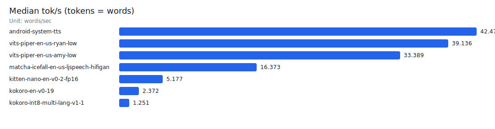
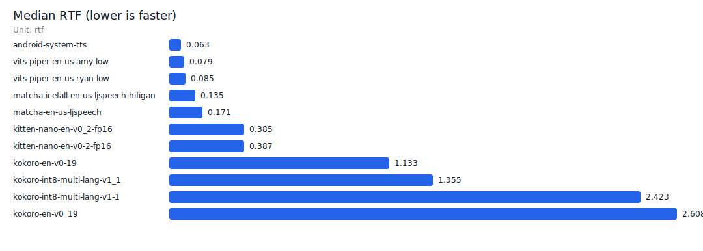

# Android Offline TTS Eval

Standalone Android app + harness for **offline TTS speed benchmarking** (physical devices only).

## Key Points
- **Tokens = words** (`[A-Za-z0-9']+`)
- Metrics per run: `tok/s` and `RTF` (speed only)
- Models are downloaded **on-demand** to app external files; optional cleanup supported
- Default ABI: `arm64-v8a` only (no emulator ABI)

## Model Catalog (Full Sherpa Zoo)
The app model list is generated from public Hugging Face repos (sherpa-onnx Offline TTS model zoo).

- The catalog includes **hundreds** of sherpa-compatible models (VITS/Piper/Coqui/Mimic3, Matcha, Kokoro, Kitten).
- Many models require `espeak-ng-data/`; this repo downloads it once as a shared dependency: `sherpa-espeak-ng-data`.
- No Hugging Face token is used; gated/private repos are skipped.

Regenerate the catalog:
```bash
python3 android-offline-tts-eval/scripts/catalog/generate_sherpa_model_catalog.py
```

Recent non-sherpa models (document-only): `android-offline-tts-eval/docs/tts_model_landscape.md`

## Project Layout
- Android app: `android-offline-tts-eval/VoicePingAndroidOfflineTtsEval/`
- Host scripts: `android-offline-tts-eval/scripts/`
- Pulled artifacts + reports: `android-offline-tts-eval/artifacts/`

## Build / Install (Physical Device)
```bash
cd android-offline-tts-eval/VoicePingAndroidOfflineTtsEval
./setup-deps.sh
./gradlew :app:installDebug
```

## Headless Benchmark (Instrumentation)
Runs the English prompt suite and writes `audio.wav` + `result.json` per prompt:
`/sdcard/Android/data/com.voiceping.ttseval/files/exports/tts_eval/<run_id>/<model_id>/<prompt_id>/`

```bash
# Default planned model set (system + sherpa models)
android-offline-tts-eval/scripts/run_device_benchmark.sh
```

Environment overrides:
- `MODEL_IDS` (comma-separated)
- `RUN_MODE` (`warm` or `cold`)
- `WARM_ITERATIONS` (1-10)
- `THREADS` (1-16)
- `SPEAKER_ID`, `SPEED`
- `DOWNLOAD_HF` (`true|false`)
- `DELETE_AFTER` (`true|false`)

Example:
```bash
RUN_MODE=warm WARM_ITERATIONS=3 THREADS=4 \
MODEL_IDS=android-system-tts,kokoro-en-v0-19 \
android-offline-tts-eval/scripts/run_device_benchmark.sh
```

Run all selectable models (expect a lot of downloads):
```bash
MODEL_IDS="" android-offline-tts-eval/scripts/run_device_benchmark.sh
```

## Pull Results + Generate Report
```bash
# Pull one run by id (recommended)
android-offline-tts-eval/scripts/pull_results.sh <run_id>

# Aggregate and generate table + bar charts
python3 android-offline-tts-eval/scripts/generate_tts_report.py --run_id <run_id>
```

Outputs:
- `android-offline-tts-eval/artifacts/report/tts_report.md`
- `android-offline-tts-eval/artifacts/report/tts_results.json`
- `android-offline-tts-eval/artifacts/report/android_tts_tok_per_sec.svg`
- `android-offline-tts-eval/artifacts/report/android_tts_rtf.svg`

## NVIDIA NeMo (Local Bundle Import)
NeMo weights are not redistributed. Export ONNX locally and push the bundle:
```bash
# host-side export (Python 3.12 recommended)
android-offline-tts-eval/scripts/nemo/create_venv.sh
source android-offline-tts-eval/scripts/nemo/.venv-nemo/bin/activate
python android-offline-tts-eval/scripts/nemo/export_fastpitch_onnx.py
python android-offline-tts-eval/scripts/nemo/export_hifigan_onnx.py

# push to device
android-offline-tts-eval/scripts/nemo/push_bundle_to_device.sh
```

## Latest Benchmark (Example)
Device: `SM-G973C` (sdk_int=31)  
Run: `benchmark_1771207849433_warm` (warm, `warm_iterations=1`, `threads=4`)

### Bar Charts



### Table
Generated by: `python3 android-offline-tts-eval/scripts/generate_tts_report.py --run_id <run_id>`

| Model ID | Engine | Prompt set | Median load (ms) | Median synth (ms) | Median tok/s | Median RTF | Count | Status |
|---|---|---:|---:|---:|---:|---:|---:|---|
| `android-system-tts` | `android_system_tts` | en | 189 | 440 | 42.48 | 0.058 | 12 | PASS |
| `vits-piper-en-us-amy-low` | `sherpa_offline_tts` | en | 2498 | 524 | 33.39 | 0.076 | 12 | PASS |
| `vits-piper-en-us-ryan-low` | `sherpa_offline_tts` | en | 2824 | 478 | 39.14 | 0.077 | 12 | PASS |
| `matcha-icefall-en-us-ljspeech-hifigan` | `sherpa_offline_tts` | en | 2924 | 1104 | 16.37 | 0.135 | 12 | PASS |
| `kitten-nano-en-v0-2-fp16` | `sherpa_offline_tts` | en | 2178 | 3526 | 5.18 | 0.387 | 12 | PASS |
| `kokoro-en-v0-19` | `sherpa_offline_tts` | en | 2367 | 8226 | 2.37 | 1.133 | 12 | PASS |
| `kokoro-int8-multi-lang-v1-1` | `sherpa_offline_tts` | en | 4581 | 15343 | 1.25 | 2.423 | 12 | PASS |
